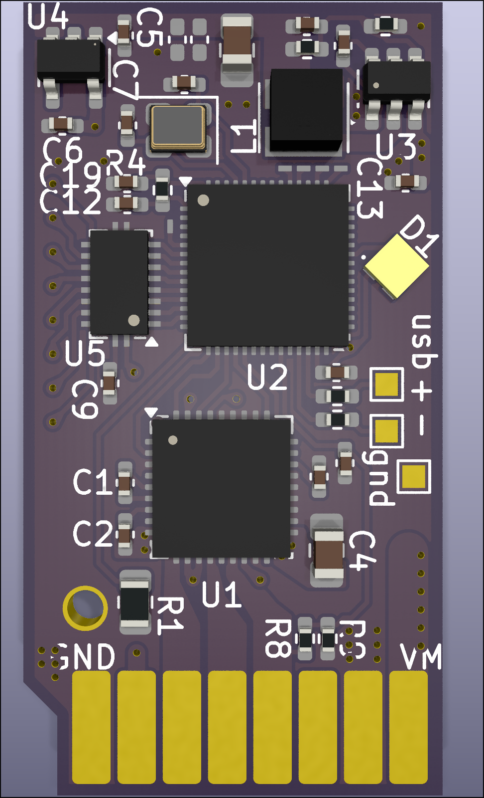

# EZCPAP

EZCPAP is a BLDC driver for [CPAP blower motors](https://www.ifixit.com/Guide/ResMed+AirSense+10+Pump+Motor+Replacement/137050) that fits in a BTT EZDriver socket, such as on an [SKR EZ](https://bttwiki.com/SKR%203%20EZ.html).

It effectively acts like a motor driver on a 3d printer. which you can then use to drive a CPAP motor for part cooling.

!! Still in the conceptual/development phase !!

[View in kicanvas](https://kicanvas.org/?github=https%3A%2F%2Fgithub.com%2Fcnf%2FEZCPAP)

## Concept render

